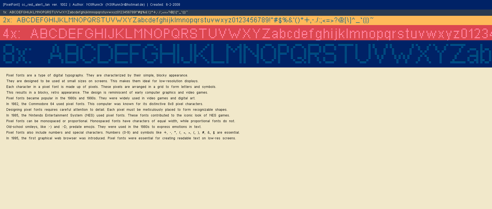

## Usage: 

1. Build the project
2. Test with the bundled test images and JSON font descriptions as shown below.

```sh
cd ~/your-work-folder/compact-bitmap-font/rust/cbf_wiz/target/debug 
./cbf_wiz -i ../../assets/cc_red_alert_lan.png -j ../../assets/cc_red_alert_lan.json -o ~/cbf -v
./cbf_wiz -i ../../assets/cc_red_alert_inet.png -j ../../assets/cc_red_alert_inet.json -o ~/cbf -v
```

## Expexted output 

- - - - - - - - - - - 

- - - - - - - - - - - 


### The "C&C Red Alert" fonts
- https://www.dafont.com/c-c-red-alert-inet.font
- https://www.dafont.com/c-c-red-alert-inet.charmap?f=1
- https://www.dafont.com/c-c-red-alert-inet.charmap?f=0

### TODO: mention `N3tRunn3r` and his permission for using the fonts here. 

//compact-bitmap-font/rust/cbf_wiz/src/cli.rs