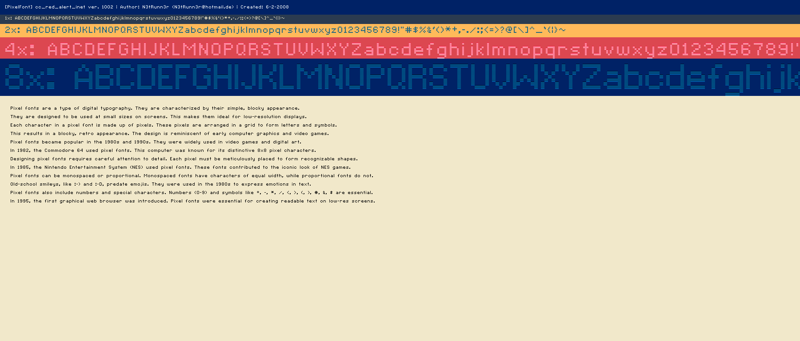

# Compact Bitmap Font Wizard

Generates CBF files based on a font image and a JSON description. 

- See [assets](assets) for examples.

## Status
> ⚠️ **NB:** The generator works correctly with the bundled test images and JSON font descriptions.

## Usage:
 
1. Build the project
2. Test with the bundled test images and JSON font descriptions as shown below.

```sh
cd ~/your-work-folder/compact-bitmap-font/rust/wiz/target/debug 
./wiz -i ../../assets/cc_red_alert_lan.png -j ../../assets/cc_red_alert_lan.json -o ~/cbf -v
./wiz -i ../../assets/cc_red_alert_inet.png -j ../../assets/cc_red_alert_inet.json -o ~/cbf -v
```

## Expected output

Files:
- `cc_red_alert_lan.cbf`
- `cc_red_alert_inet.cbf`

Font sample outputs:
- 
- 
 


### The "C&C Red Alert" fonts
- https://www.dafont.com/c-c-red-alert-inet.font
- https://www.dafont.com/c-c-red-alert-inet.charmap?f=1
- https://www.dafont.com/c-c-red-alert-inet.charmap?f=0

A written permission was received from the author (`N3tRunn3r`) to use the `c-c-red-alert-*` fonts in this project.

