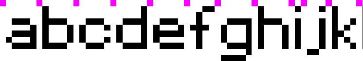

# Compact Bitmap Font (CBF): A Designer's Guide

The **Compact Bitmap Font (CBF)** format is a compact, memory-efficient format for bitmap (pixel) fonts. 
It is designed to be used on the Web, in embedded systems, retro-style games, terminals, and anywhere performance and simplicity matter.

---

## 🧹 Quick start

To compile a CBF font, you need:

1. **A PNG image** with your pixel font glyphs, arranged in a single row.
2. **A JSON config** file with font layout settings and some metadata.

Feel free to [download](./media/sample-font-assets.zip) these zipped [PNG and JSON files](./media/sample-font-assets.zip) and use them as a starting point.
You can modify them to your liking, the author of the Red Alert fonts was contacted, and he permitted to use the font in any way we like. 

## 🛠️ Where to compile the font

The font compiler is available as:
- An online tool: https://coduments.com/to-be-announced
- A CLI tool:
    - Download a binary: https://coduments.com/to-be-announced
    - Build from source code: https://github.com/dipdowel/compact-bitmap-font/tree/develop/rust/cbf_wiz

---

## 🎨 Specification of the PNG with font glyphs

Here's a zoomed-in fragment of the PNG with font glyphs:



* ⚠️ The image above was scaled up for illustration purposes!
* Please see [the complete correct PNG with glyphs here](./media/cc_red_alert_inet.png).

- - - - - - - -

### ✅ Format and Layout

| Requirement        | Description                                                                                                                                                  |
| ------------------ |--------------------------------------------------------------------------------------------------------------------------------------------------------------|
| File format        | PNG, **without transparency**                                                                                                                                |
| Color mode         | RGB                                                                                                                                                          |
| Background color   | Solid white (`#FFFFFF` / `RGB(255, 255, 255)`)                                                                                                               |
| Glyph layout       | All glyphs must be arranged **horizontally in a single row**, in the order defined in the JSON's `char_order` (see below)                                    |
| Glyph color        | Solid black (`#000000` / `RGB(0, 0, 0)`)                                                                                                                     |
| Top padding        | Exactly **1px padding** above the [ascenders](https://en.wikipedia.org/wiki/Ascender_%28typography%29), that 1px vertical space houses the glyph separators. |
| Bottom padding     | None — [descenders](https://en.wikipedia.org/wiki/Descender) of glyphs must touch the bottom edge of the image                                               |
| Left/Right padding | Exactly **1px margin** on each side (background color)                                                                                                       |
| Separation markers | **1-pixel colored dots** on the line above [ascenders](https://en.wikipedia.org/wiki/Ascender_%28typography%29), horizontally -- between the glyphs          |
| Start/end  markers | The pixel in the top-left corner and the pixel in top-right corner of the image must contain the glyph separator.                                            |
| Horizontal spacing | **1px wide white space** (background color) to separate glyphs from each other                                                                               |
| The 'space' glyph  | The charset **must** include space character, so there should be a corresponding glyph in the PNG.                                                           |

### Sizes
Each pixel in the PNG with font glyphs must represent exactly 1 pixel in the resulting font. 

### Visual glyph separators
Character glyphs are separated by a **colored pixel**, called the glyph separator.
The glyph separator is located:
- Horizontally: in between the glyphs 
- Vertically: in the 1-pixel space right above the tallest [ascender](https://en.wikipedia.org/wiki/Ascender_%28typography%29).


### Horizontal spacing between the glyphs
Horizontally, the glyphs must be separated by a 1-pixel-wide white space (background color).
 
* ⚠️ The image should contain **no extra padding or alignment guides** outside of what’s described above.

---

## 🧾 JSON font configuration

Here's the JSON with the configuration and metadata for the [PNG with glyphs](./media/cc_red_alert_inet.png) mentioned earlier.

```json
{
  "char_order": " ABCDEFGHIJKLMNOPQRSTUVWXYZabcdefghijklmnopqrstuvwxyz0123456789!\"#$%&'()*+,-./:;<=>?@[\\]^_`{|}~",
  "default_char": "?",
  "spacing": {
    "kerning_px": 2,
    "leading_px": 10
  },
  "meta": {
    "font_ver": 1002,
    "date_year": 2008,
    "date_month": 2,
    "date_day": 6,
    "font_name": "cc_red_alert_inet",
    "author_signature": "N3tRunn3r (N3tRunn3r@hotmail.de)"
  },
  "sample_text": [
    "Pixel fonts are a type of digital typography. They are characterized by their simple, blocky appearance.",
    "They are designed to be used at small sizes on screens. This makes them ideal for low-resolution displays.",
    "Each character in a pixel font is made up of pixels. These pixels are arranged in a grid to form letters and symbols.",
    "This results in a blocky, retro appearance. The design is reminiscent of early computer graphics and video games.",
    "Pixel fonts became popular in the 1980s and 1990s. They were widely used in video games and digital art.",
    "In 1982, the Commodore 64 used pixel fonts. This computer was known for its distinctive 8x8 pixel characters.",
    "Designing pixel fonts requires careful attention to detail. Each pixel must be meticulously placed to form recognizable shapes.",
    "In 1985, the Nintendo Entertainment System (NES) used pixel fonts. These fonts contributed to the iconic look of NES games.",
    "Pixel fonts can be monospaced or proportional. Monospaced fonts have characters of equal width, while proportional fonts do not.",
    "Old-school smileys, like :-) and :-D, predate emojis. They were used in the 1980s to express emotions in text.",
    "Pixel fonts also include numbers and special characters. Numbers (0-9) and symbols like +, -, *, /, <, >, (, ), #, &, $ are essential.",
    "In 1995, the first graphical web browser was introduced. Pixel fonts were essential for creating readable text on low-res screens."
  ]
}


```

### What that JSON is about:

- `char_order`
  - Tells the compiler how the character glyphs are ordered in the PNG.  
  - ⚠️ You **must** include the `space` character both into the PNG and into `char_order` string. 

- `default_char`
  - The default character acts as a fallback when a character does not exist in the font.
  - ⚠️ The default **must** be a character present in the `char_order` string!
  - If the user tries to display `ä` but it's not in the font, then the default character (e.g. `?`) is rendered instead.
  - ⚠️ If `default_char` is not specified, the compiler will refuse to build the font!

- `spacing` -- the default `kerning` and `leading` for the font specified by the designer
  - `kerning_px` -- Specifies the horizontal space between any pair of characters in the font.
  - `leading_px` -- Specifies the vertical space between lines of text.

- `meta`
  - `font_ver` -- the version of the font, any number, e.g. `1002`
  - `date_year` -- the year of the font creation, e.g.: `2008`
  - `date_month` -- the month of the font creation, e.g.: `2` for February
  - `date_day` -- the day of the month of the font creation, e.g.: `15`
  - `font_name` -- name of the font
  - `author_signature` -- any string telling who the author of the font is. You can include your email or other contact details.  

- `sample_text` -- An array of lines of text that will be used to print a sample text with the created font.
 

---

## License

See the [MIT License with attribution](../LICENSE)

